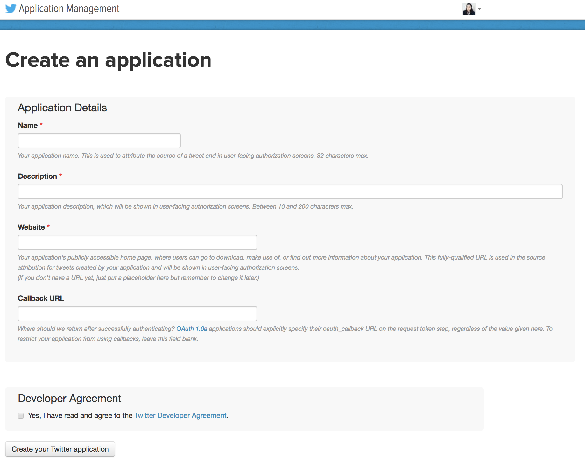

## A sample application using Twitter OAuth and Algolia Search. 

### What is this used for?
A speedy, search-as-you-type experience for exploring your twitter timeline.

We use Twitter authenticate a user, on successful authentication of a user, we take the username parameter, call the `GET_USER_TIMELINE` method from Twitter's API to fetch the users last 500 tweets. Then we create Algolia objects with the data we need from Twitter and send it to the Algolia API to be indexed. Then we use Algolia's ranking tools and display tweets with their favorite and retweet count first rather than date. 

# How to Remix into your own! 🎏
- Hit that sweet sweet remix link 
- Sign up for a [Twitter app account](https://apps.twitter.com/app/new) and add your credentials in the .env file
- Sign up for an [Algolia account](https://www.algolia.com/cc/glitch) and add your credentials in the .env file

## Sign up for a Twitter account 🐦
You only need a few things to get started with a Twitter app, so let's get started! Once we land on this page:

We want to fill that in with your application name, can be anything, but your user will see it when they are authorizing. Choose something like `awesome_twitter_search_app`, it must be under 32 characters. 
Then we fill out a quick description like `app to authorize twitter to look at my tweets`, it must be under 200 characters.
Final step! We need a URL, so let's use the one Glitch auto-generates for us like `	https://dazzling-brick.glitch.me`. Be sure to grab the `https://` prefix!

After creation, you'll see a summary of your applciation credentials. The two things to note here are your default Read/Write application settings and your keys and access tokens.

For this applicaiton, we really only need to read tweets, so let's change that.

Navigate to the Keys and Access Tokens tab and you'll be grabbing _four_ keys for your `.env` file. Before grabbing your keys, you'll need to create an access token (just with one click!).

You can now grab all the keys from this page you need and put them into your project.

Consumer Key (API Key) should go with your `TWITTER_CONSUMER_KEY`
Consumer Secret (API Secret) should go with your `TWITTER_CONSUMER_SECRET`
Access Token should go with your `TWITTER_ACCESS_KEY`
Access Token Secret should go with your `TWITTER_ACCESS_TOKEN_SECRET`

You're all set from the Twitter side! Let's move onto Algolia.

## Sign up for an Algolia account 🔎
We have a few more steps and then we can begin! First, we'll bring you to our sign up page, where you can create a new account with your own password, or use GitHub or Google authentication.

Once you have successfully signed in, you'll see your dashboard! Navigate to your API Keys on the left hand side of the screen, you'll be grabbing _three_ keys for your `.env` file.

Application ID should go with your `ALGOLIA_APP_ID`
Search-Only API Key should go with your `ALGOLIA_SEARCH_API_KEY`
Admin API Key should go with your `ALGOLIA_ADMIN_API_KEY`

Okay, you're all set! Your app should be purring, green lighted, ready to go! 

et voilà! You can now authorize tweets on your account and the code will create an index in your Algolia account under the name `tweets` and you can choose different options from here. 

Tweet at us for what you create, [Algolia Tweets](https://twitter.com/algolia) we'd love to check it out!

## Remix Ideas
So what’s next?
We’ve done the building blocks for this application, but there is so much more you can do! Some of our ideas include:
- Changing the Twitter API call to be able to fetch a user's entire timeline with multiple page calls.
- Add sentiment analysis and use faceting to apply a filter
- Allow index to be multi-tenant.
